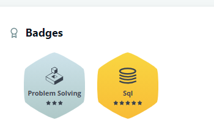
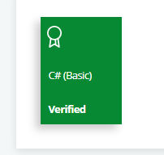
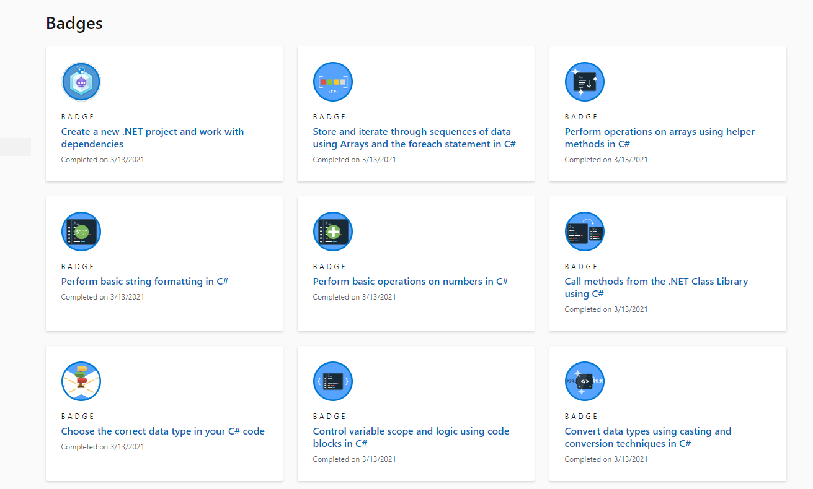
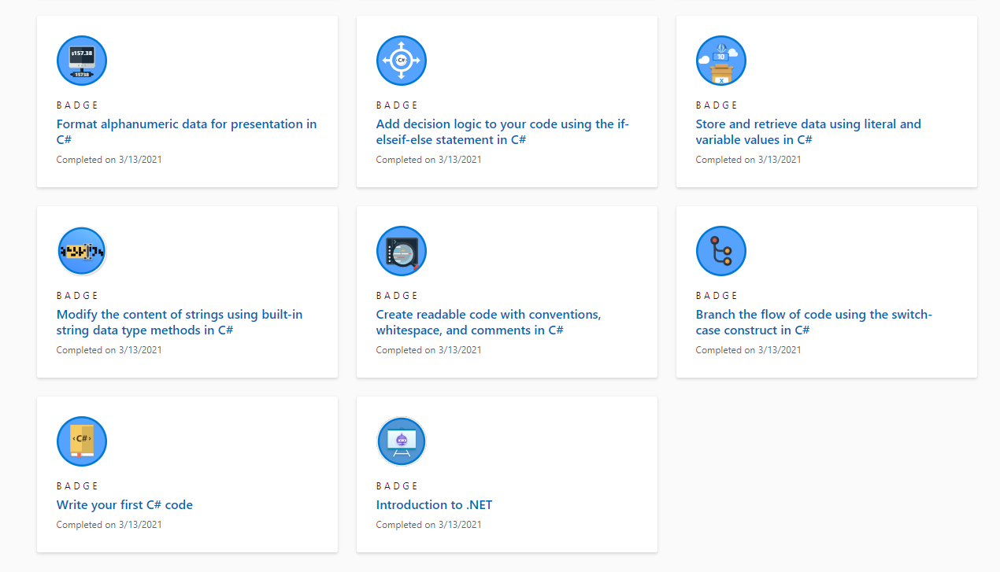
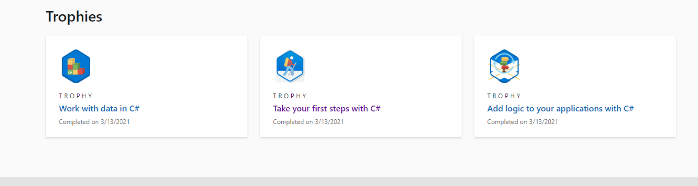
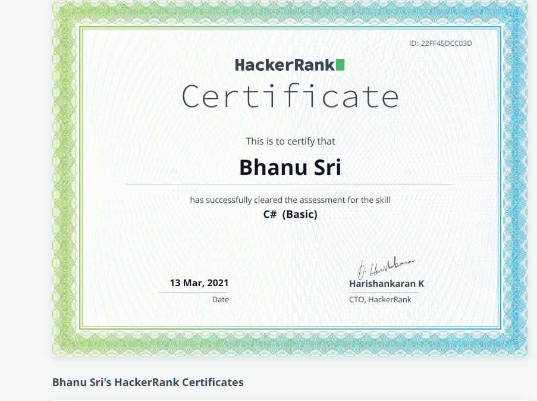

Bhanu Sri Madeti

`			                                     `**Email**: <madeti.bhanusri@ltts.com>

`                                                                                             `**Mobile Number**: 8919856575

`          `I hereby declares, this profile discriminates the Skills, Badges and Certificates which I having.

**Programming Skills**: CSharp

**Frameworks:** 

- .NET Framework 
- ADO.NET 	
- Entity Framework 
- ASP.NET MVC
- ASP.NET Web API 

**Tools:** 

- Microsoft SQL Server Management Studio(SSMS)
- Visual Studio 2019
- Postman
- LINQPad

**Platforms:**

- Azure DevOps
- GitHub

**Badges**:

`             `Hackerrank

`     `

` `Microsoft:

`        `Achievements:

**Certificates**:

`           `Hackerrank(CSharp)-  <https://www.hackerrank.com/certificates/22ff45dcc03d>

`               `

**Mini-Projects**:

` `C Sharp- <https://github.com/99003577/DemoKart.git>

` `SQL- <https://github.com/99003577/Demokart_DB.git>

